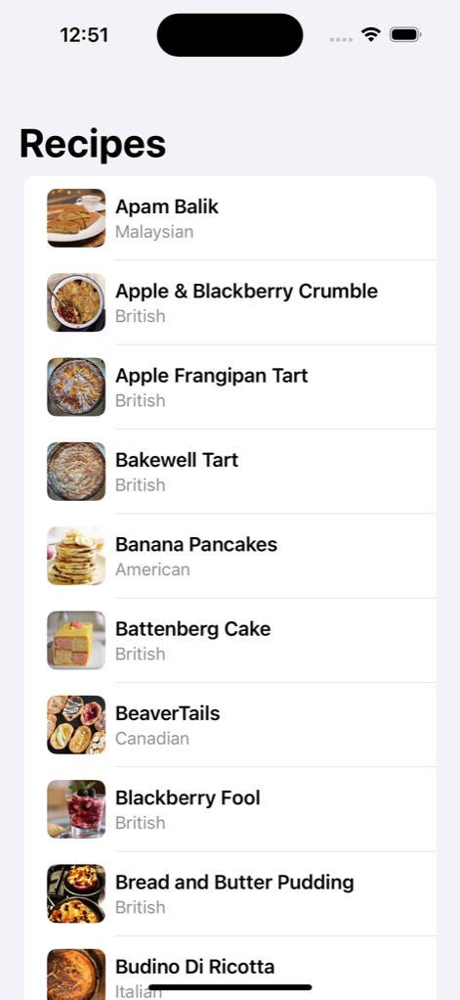

Fetch Recipe App

## Overview
Fetch Recipe App is a SwiftUI-based iOS application that retrieves and displays a list of recipes from a remote API. It is designed with performance and user experience in mind, utilizing Swift Concurrency (`async/await`) for efficient networking, image caching for optimized loading, and pull-to-refresh functionality for real-time updates.

### Features
- Fetches and displays recipes from an API using `URLSession` and `async/await`
- Implements custom image caching to minimize redundant network requests
- Supports pull-to-refresh for real-time data updates
- Handles network errors and malformed data gracefully
- Dark Mode compatibility for improved accessibility
- Unit tests for API fetching to ensure data integrity

## Screenshots



## How to Run
To run this project locally, follow these steps:

1. Clone the repository:
   ```sh
   git clone https://github.com/YOUR_USERNAME/FetchRecipeApp.git
   cd FetchRecipeApp
   ```
2. Open the project in Xcode (iOS 16+ required).
3. Select an iPhone Simulator (e.g., iPhone 15 Pro).
4. Run the app by pressing `Cmd + R`.

## Tech Stack
- Swift 5
- SwiftUI
- URLSession (Networking)
- Codable (JSON Parsing)
- Swift Concurrency (`async/await`)
- XCTest (Unit Testing)

## Project Structure
The project follows a modular and maintainable structure, adhering to MVVM principles.

```
FetchRecipeApp
 ├── FetchRecipeAppApp.swift    # Entry point of the app, initializes ContentView
 ├── ContentView.swift          # Main UI displaying the list of recipes
 ├── Models
 │   ├── Recipe.swift           # Defines the Recipe data model and API response structure
 ├── Services
 │   ├── RecipeService.swift    # Handles API calls using async/await
 ├── ViewModels
 │   ├── RecipeViewModel.swift  # Manages app state, API requests, and error handling
 ├── Views
 │   ├── RecipeRow.swift        # UI component for displaying a single recipe in the list
 │   ├── CachedAsyncImage.swift # Custom view for asynchronous image loading with caching
 ├── Utils
 │   ├── ImageCache.swift       # Implements image caching for improved performance
 ├── Tests
 │   ├── RecipeServiceTests.swift # Unit tests to verify API functionality
 ├── Assets.xcassets            # Stores app images and assets
 ├── README.md                  # Documentation for setup and features
```

## Unit Test Results
Unit tests were conducted to validate the API fetching functionality. 
Additional UI tests have also been performed just ensure working of all modes(light, dark, landscape, potrait, switching), all 4 tests passed, results have not been included.

```
Test Suite 'RecipeServiceTests' passed at 2025-03-13 00:42:58.717.
Executed 1 test, with 0 failures (0 unexpected) in 1.345 seconds.
```


## Trade-offs and Decisions
- Implemented custom image caching instead of using third-party libraries for better control.
- Focused on a minimal and efficient UI while ensuring a smooth user experience.
- Used only Apple's built-in frameworks to meet project requirements.


